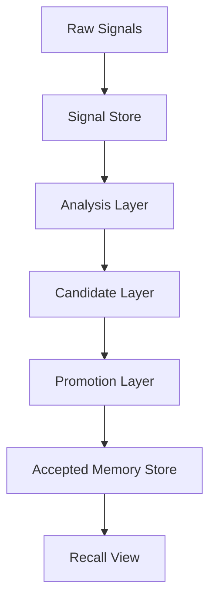

# Memory Plane Blueprint

## 定义

`memory-plane` 不是“记忆存储系统”，而是“价值记忆提取系统”。

它的核心任务不是多存，而是把高维、嘈杂、连续变化的上下文，稳定地提取成少量、可复用、可召回的长期记忆。

这个系统的主设计原则只有三个：

- `隔离`
- `分层`
- `压缩`

## 我们真正要解决的问题

工程现场里的高价值记忆，很多都不是被明确说出来的。

例如：

- 用户创建了一个基础按钮组件
- 它被放进公共层
- 它被统一导出
- 新页面开始优先复用它
- 旧代码逐步向它收敛

用户通常不会专门说：

`这是项目的默认按钮抽象，以后都应该用它。`

但系统应该能从这些上下文中提取出这条长期记忆。

所以问题的本质不是：

- 怎么根据关键词识别记忆
- 怎么把一段文本直接存起来

而是：

- 怎么把原始上下文和记忆提取隔离开
- 怎么把提取过程分层
- 怎么把复杂上下文压缩成稳定记忆

## 三个原则到底是什么意思

### `隔离`

把不同问题彻底拆开，不要混在一起。

至少要隔离这几类对象：

- 原始信号
- 分析中间态
- 候选记忆
- 已接受长期记忆
- recall 结果

也就是说：

- 对话不是记忆
- 代码快照不是记忆
- 一个推断也不是记忆
- 只有经过晋升的结果，才是长期记忆

### `分层`

记忆提取不能指望一个“总算法”一次完成，而是要分层处理。

每层只解决一个问题，并给下一层稳定输入。

### `压缩`

压缩不是摘要，而是把大量上下文信号，收敛成一个低维、稳定、可复用的记忆对象。

例如：

- 从多次协作行为压缩出一个用户偏好
- 从代码结构和复用趋势压缩出一个项目约束
- 从多次失败和修复压缩出一个故障模式
- 从业务术语和字段映射压缩出一个领域事实

## 系统目标

`v1` 的目标是：

- 不把 LLM 当主判定器
- 用工程化流水线提取价值记忆
- 优先抓住隐式约定，而不只是显式句子
- 先保证高精度，再逐步提高召回
- 先形成稳定闭环，再考虑图谱、复杂 UI 和更强自动化

## 非目标

`v1` 暂时不追求：

- 理解所有自然语言语义变体
- 自动覆盖所有记忆类型
- 一次性做图谱层
- 一次性做复杂审批系统
- 一次性做组织级细粒度权限

## 记忆类型

`v1` 只允许五类长期记忆：

- `user_preference`
- `project_constraint`
- `technical_decision`
- `recurring_failure_pattern`
- `domain_fact`

原因很简单：

- 这五类最稳定
- 最能改变未来动作
- 最值得压缩保留

## 什么不进入长期记忆

以下内容默认不进入正式长期记忆：

- 本轮过程
- 临时调试日志
- 一次性修复记录
- 未确认推断
- 瞬时环境状态
- 与未来动作无关的背景信息
- 敏感信息

## 什么叫“值得存”

每条正式长期记忆，都必须能回答：

`why_store = 它未来到底能减少什么重复成本？`

答案只允许落在这些收益里：

- 避免重复问用户
- 避免重复踩坑
- 避免错误决策
- 缩短方案选择时间
- 保持跨任务一致性

如果回答不上来，就不该晋升。

## 核心系统模型

这套系统不是数据库模型，而是处理流水线模型：



这 6 个节点就是主实现。

## 五层实现

### 1. 信号层 `Signal Layer`

职责：

- 接收真实工作输入
- 只做归档和标准化
- 不做“是否值得存”的判断

输入来源：

- 用户消息
- assistant 消息
- 代码快照
- 代码 diff
- 配置
- 命令结果
- 测试结果
- 文档片段

输出对象：

- `signal`

核心要求：

- 原始性
- 可追溯
- 不丢上下文来源

### 2. 分析层 `Analysis Layer`

职责：

- 从信号中提取“可被压缩”的证据
- 把上下文拆成三类证据

三类证据：

- `explicit evidence`
- `structural evidence`
- `behavioral evidence`

这层的重点不是“分类句子”，而是回答：

`当前上下文里，哪些事实值得被进一步归纳？`

输出对象：

- `evidence bundle`

### 3. 候选层 `Candidate Layer`

职责：

- 把证据归纳成一个原子化 candidate claim
- 为 candidate 附上 scope、why_store、证据集合

这层产出的不是 memory，而是：

- `candidate`

candidate 的本质是：

- 一个待验证的压缩结果

### 4. 晋升层 `Promotion Layer`

职责：

- 判断 candidate 是否值得成为长期记忆
- 判断它是新记忆、补强旧记忆，还是冲突旧记忆
- 维护状态机

输出状态至少包括：

- `accepted`
- `needs_confirmation`
- `reinforce_existing`
- `rejected`
- `conflicted`

### 5. 记忆层 `Memory Layer`

职责：

- 保存已接受长期记忆
- 保留证据链
- 支持后续被强化、替代、过期

输出对象：

- `memory`

### 6. 使用层 `Recall Layer`

职责：

- 面向任务返回真正需要的长期记忆
- 不重新做复杂提取
- 只消费已经被系统接受过的记忆

输出对象：

- `recall packet`

## 三类证据是核心实现关键

这部分才是系统真正的识别核心。

### `explicit evidence`

来自明确表达：

- 用户直接说出的偏好
- 文档中的定义
- 配置中的硬规则
- 明确的决策语句

它的特点：

- 成本低
- 精度高
- 但覆盖面有限

### `structural evidence`

来自工程结构：

- 文件所在目录层级
- 是否处于公共基础层
- 是否统一导出
- 是否包装底层原语
- 是否被多个模块依赖
- 是否拥有测试、文档、story、token 等配套

这层回答的问题是：

`这个东西是不是已经被项目结构当成标准抽象？`

### `behavioral evidence`

来自演化行为：

- 新代码是否持续复用某抽象
- 旧代码是否逐步向某抽象收敛
- 偏离实现是否被替换
- 某种修复路径是否反复成功
- 某错误模式是否重复出现

这层回答的问题是：

`项目实际是不是在沿某种约定持续演化？`

## 关键词在系统里的角色

关键词不是主识别机制，只是低层辅助特征。

例如这些 cue：

- `以后`
- `默认`
- `必须`
- `不要`
- `统一`

它们可以增强某个显式证据，但不能单独决定长期记忆晋升。

也就是说，系统不能因为命中了 `默认` 就写记忆，也不能因为没命中这些词就错过隐式约定。

## 核心压缩对象

系统真正要压缩的，不是文本，而是上下文。

### 从什么压缩

- 多条消息
- 多个代码文件
- 多次 diff
- 多个使用点
- 多次失败/修复记录

### 压缩成什么

- 一个原子化 claim
- 一组证据
- 一个明确 scope
- 一个 why_store
- 一个可管理状态

### 压缩标准

压缩后的结果必须：

- 稳定
- 可验证
- 可复用
- 可追溯
- 可和历史对象比较

## 核心对象

### `signal`

原始输入，不做长期记忆语义承诺。

### `evidence bundle`

从多个 signal 中提取出来的证据包。

它是中间态，不是记忆。

### `candidate`

候选记忆，是第一层压缩结果。

它至少包含：

- `memory_type`
- `claim`
- `scope`
- `why_store`
- `evidence[]`
- `features`
- `status`

### `memory`

正式长期记忆，是经过晋升后的压缩结果。

它至少包含：

- `memory_type`
- `claim`
- `scope`
- `why_store`
- `evidence[]`
- `confidence`
- `status`
- `first_seen_at`
- `last_seen_at`

## 实现流水线

如果从编码角度看，核心实现就是下面这条链：

`signals -> evidence extraction -> candidate build -> candidate match -> promotion decision -> memory update`

展开后是：

1. 接收原始 signals
2. 为每个 signal 提取显式、结构、行为证据
3. 聚合证据，构造 candidate
4. 与已有 candidate / memory 做匹配
5. 判断是新对象、补强还是冲突
6. 根据规则和分数决定状态
7. 更新 candidate pool 或 memory store

这才是主实现，不是几个关键词规则。

## Candidate Matching 是实现关键

系统拿到 candidate 后，不能直接晋升。

必须先做匹配，回答：

- 这是新 claim 吗
- 这是旧 claim 的另一种表达吗
- 这是旧 claim 的补充证据吗
- 这是对旧记忆的冲突吗

如果没有这层，系统就会：

- 重复写入同一记忆
- recall 结果堆满相似结论
- 无法处理演化和替代

## 晋升机制

晋升不是“识别到了就存”，而是：

- 先过滤明显不该记的对象
- 再计算值得保留的程度
- 最后决定状态

推荐主逻辑：

```text
if violates_hard_rules(candidate):
  return rejected

if is_conflict(candidate, registry):
  return conflicted

if reinforces_existing(candidate, registry):
  return reinforce_existing

score = compute_score(candidate)

if score >= ACCEPT_THRESHOLD and evidence_is_strong(candidate):
  return accepted

if score >= HOLD_THRESHOLD:
  return needs_confirmation

return rejected
```

这里的重点不是分数本身，而是：

- 分数只是晋升参考
- 真正核心是证据质量、匹配结果和状态机

## `BaseButton` 场景怎么实现

这是一个标准的隐式约定提取例子。

### 原始 signals

- 新增 `src/shared/ui/BaseButton.vue`
- `src/shared/ui/index.ts` 导出 `BaseButton`
- 最近 8 个新增页面中有 7 个引入 `BaseButton`
- 2 个旧页面把原生 `button` 替换为 `BaseButton`
- 按钮 token 只在 `BaseButton` 中维护

### analysis layer 提取出的证据

`structural evidence`

- 位于公共基础层
- 包装底层原语
- 被统一导出
- 被多个模块复用

`behavioral evidence`

- 新代码优先使用
- 旧代码向它收敛
- 出现标准化替换路径

### candidate layer 形成的候选

```json
{
  "memory_type": "project_constraint",
  "claim": "项目默认按钮抽象应优先复用 BaseButton。",
  "why_store": "保持 UI 一致性，避免重复封装和样式漂移。"
}
```

### promotion layer 的决策

- 如果只是刚创建，没有形成复用：
  - `needs_confirmation`
- 如果已经被稳定复用并出现收敛：
  - `accepted`

这个例子说明：

- 我们识别的不是“按钮组件”这四个字
- 我们识别的是“项目正在把 BaseButton 当默认按钮抽象”

## 代码实现该怎么拆

如果现在开干，建议直接按下面模块落：

### `signals/`

负责采集和标准化原始输入

### `analysis/`

负责提取：

- `explicit evidence`
- `structural evidence`
- `behavioral evidence`

### `candidates/`

负责构造 candidate

### `matching/`

负责 candidate 与历史 candidate / memory 的匹配

### `promotion/`

负责规则、分数、状态机和决策

### `memory-store/`

负责 accepted memory 的状态维护

### `recall/`

负责 recall packet 的构造和排序

## 最小主循环

下面这段就是 `v1` 的核心实现：

```text
signals = ingest(raw_inputs)

for each signal in signals:
  explicit = extract_explicit_evidence(signal)
  structural = extract_structural_evidence(signal, repo_snapshot)
  behavioral = extract_behavioral_evidence(signal, history_window)

  evidence_bundle = merge_evidence(explicit, structural, behavioral)
  candidates = build_candidates(evidence_bundle)

  for each candidate in candidates:
    match = match_candidate(candidate, registry)
    candidate = merge_match(candidate, match)

    decision = promote(candidate, registry)
    apply_decision(candidate, decision, registry)
```

如果要看“实现核心”，上面这段就是最小答案。

## `v1` 最小落地范围

先不要把系统做大，只做这条闭环：

1. 支持 `signal` 采集
2. 支持三类 evidence 提取
3. 支持 candidate 构造
4. 支持 candidate matching
5. 支持 promotion decision
6. 支持 accepted memory 存储
7. 支持 recall 只读 accepted memory

## 最终结论

这套系统的核心不是：

- 存在哪里
- 用不用图谱
- 某个关键词规则
- 某个神奇模型

核心是：

**把复杂上下文隔离开、分层处理，并压缩成稳定长期记忆。**

只要这条主线做对：

- 存储可以后换
- 图谱可以后挂
- LLM 可以后接
- UI 可以后补

但如果这条主线做不对，后面所有能力都会被噪音污染。
